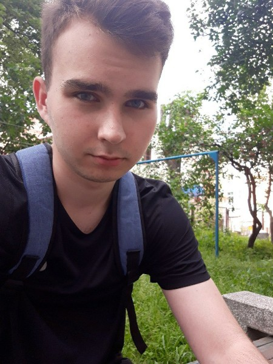

#Junior Front-End Developer
**Denis Merechko, 13.08.1999**



##Contacts

[VK](https://vk.com/endkeeper13) [Github](https://github.com/endkeeper)

E-mail: denismerechko99@gmail.com

Discord: Endkeeper#6950 

##About me
Hey! My name Denis. I’m 22 years old. I was born in Ivanovo, now I live in Kobrin.
I study at Brest State Technician University. I am a second-year student. I work for the Department of guard as engineer.
In future I want to be a front-end developer. 

##Code
```
public class Multiply {
    public static Double multiply(Double a, Double b) {
        return a * b
    }
}
```
##Projects
[Текущий проект](https://github.com/endkeeper/rsschool-cv/)


